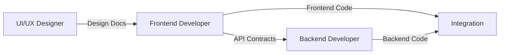

# 📝 Code Implementation Guide - Critical Update

## Problem Identified
The original Frontend and Backend Developer prompts focused on creating documentation rather than actual code. This guide addresses that gap and ensures proper implementation.

## Solution Overview

### 1. Updated Developer Prompts (v2)
We've created enhanced versions that emphasize **actual code writing**:
- `4. FrontendDeveloperPrompt_v2.md` - Writes real frontend code
- `5. BackendDeveloperPrompt_v2.md` - Writes real backend code

### 2. Clear Implementation Flow



### 3. Session Continuity System
To handle Claude's conversation limits:
- SESSION_STATE.md - Tracks current progress
- IMPLEMENTATION_LOG.md - Records all work done
- HANDOFF.md - Enables seamless session transitions

## Key Changes Made

### Frontend Developer Now:
1. **Writes actual code** using artifacts
2. Creates working components, not just documentation
3. Builds complete frontend application
4. **Generates APIContracts.md** for Backend Developer
5. Maintains session continuity files

### Backend Developer Now:
1. **Reads Frontend's APIContracts.md first**
2. Implements exact API endpoints Frontend expects
3. Writes actual server code
4. Creates matching data models
5. Ensures perfect integration

## Implementation Sequence

### Phase 1: Frontend Development
1. Frontend Dev reads UI/UX designs
2. Creates component structure
3. Builds all UI components
4. Implements state management
5. **Defines needed API endpoints**
6. Creates APIContracts.md for Backend

### Phase 2: Backend Development
1. Backend Dev reads APIContracts.md
2. Implements exact endpoints specified
3. Creates database models
4. Builds authentication system
5. Adds third-party integrations
6. Tests against Frontend requirements

### Phase 3: Integration
1. Run both applications together
2. Test all API connections
3. Fix any mismatches
4. Document integration results

## Handling Session Limits

### When Approaching Limit:
1. Claude creates HANDOFF.md with:
   - Current progress summary
   - Exact next steps
   - File locations
   - Any blocking issues

2. Updates SESSION_STATE.md with:
   - Components completed
   - Tasks remaining
   - Current file being worked on

### Starting New Session:
```
Continue [Frontend/Backend] development from previous session.
Read SESSION_STATE.md and HANDOFF.md, then continue from 
the documented checkpoint.
```

## Critical Success Factors

### 1. API Contract Agreement
- Frontend defines what it needs
- Backend implements exactly that
- No assumptions or variations

### 2. Session Documentation
- Every session updates progress files
- Clear handoff between sessions
- No lost context or code

### 3. Actual Code Output
- Use artifacts for all code
- Save files to filesystem
- Test as you build

## Example API Contract

Frontend creates this for Backend:
```markdown
# API Contracts

## User Authentication

### POST /api/auth/login
Request:
{
  "email": "string",
  "password": "string"
}

Response (200):
{
  "token": "string",
  "user": {
    "id": "string",
    "email": "string",
    "name": "string"
  }
}

Response (401):
{
  "error": "Invalid credentials"
}
```

Backend implements exactly this specification.

## Directory Structure

```
/[project-path]/
├── frontend/
│   ├── src/
│   ├── SESSION_STATE.md
│   ├── IMPLEMENTATION_LOG.md
│   └── HANDOFF.md
├── backend/
│   ├── src/
│   ├── SESSION_STATE.md
│   ├── IMPLEMENTATION_LOG.md
│   └── HANDOFF.md
├── docs/
│   ├── Frontend Developer/
│   │   ├── APIContracts.md
│   │   └── FRONTEND_COMPLETE.md
│   └── Backend Developer/
│       └── BACKEND_COMPLETE.md
└── INTEGRATION_RESULTS.md
```

## Quick Reference Commands

### Continue Frontend:
```
Continue frontend development from SESSION_STATE.md. 
Implement the next components listed in pending tasks.
```

### Start Backend:
```
Begin backend development. Read Frontend's APIContracts.md
and implement all specified endpoints exactly.
```

### Check Integration:
```
Test frontend-backend integration. Run both applications
and verify all API connections work correctly.
```

## Remember
1. **Always write actual code**, not just documentation
2. **Frontend defines the API contract** that Backend follows
3. **Document progress** for session continuity
4. **Test integration** before considering complete

The enhanced prompts ensure real code is written and perfect integration is achieved!
